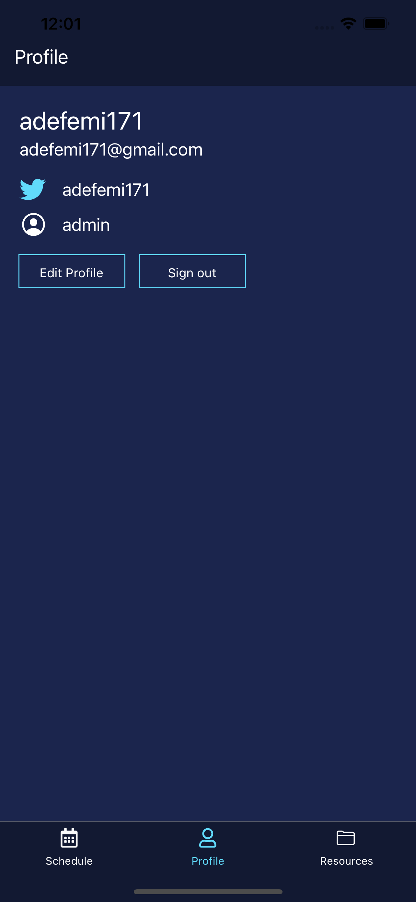
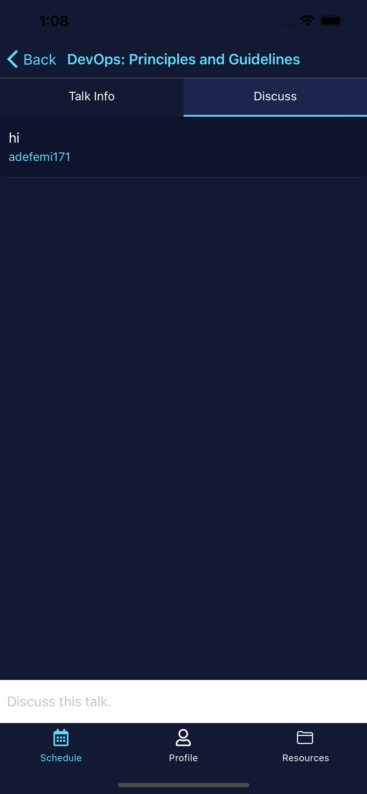
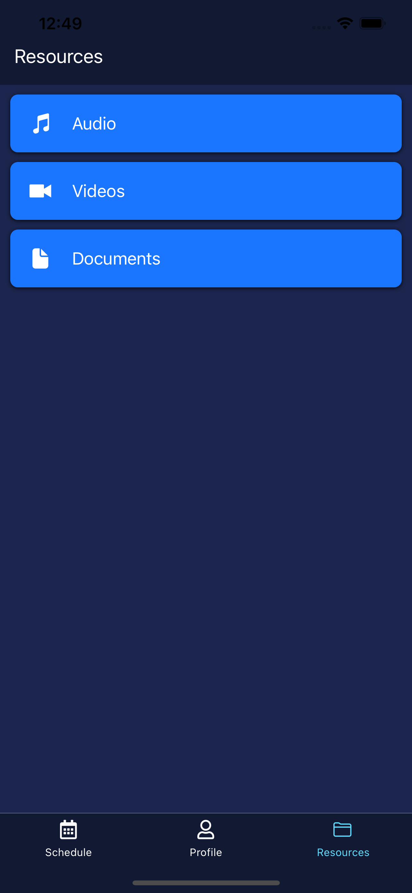

# Project App

#### Deploy a full stack & cross-platform mobile app for your next event in minutes.

🛠 Built with React Native, GraphQL, AWS Amplify, & AWS AppSync


### Features

⚡️ Real-time chat   
👾 Themeable & customizable   
👮‍♂️ Authentication & Profile view   
🔥 Serverless back end   
🚀 GraphQL   
💻 Deploy back end in minutes





## Deploy the back end and run the app

1. Clone the repo, check out the Expo branch, & install the dependencies

```sh
~ git clone https://github.com/adefemi171/Project_App

~ cd Project_App


~ npm install
```

2. Initialize and deploy the Amplify project

```sh
~ amplify init

? Enter a name for the environment: dev (or whatever you would like to call this env)
? Choose your default editor: <YOUR_EDITOR_OF_CHOICE>
? Do you want to use an AWS profile? Y

~ amplify push

? Are you sure you want to continue? Y
? Do you want to generate code for your newly created GraphQL API? N

> We already have the GraphQL code generated for this project, so generating it here is not necessary.
```

3. Start the app

```sh
~ expo start
```

## To populate the database with your conference speakers

1. Sign up in the app after following the previous steps

2. Open the AppSync console:

```sh
~ amplify console api
```

3. Click on __Queries__ to open the GraphiQL Editor. When prompted to "Login with User Pools", you can login with your new username and use the `aws_user_pools_web_client_id` located in __aws-exports.js__ for the ClientId.

4. Create a new talk with the following GraphQL mutation:

```graphql
mutation createTalk {
  createTalk(input: {
    name: "Observabilty Engineering",
    summary: "In this talk, we will look at seecuring Kubernetes and Monitoring",
    speakerName: "Afolabi Ayodeji",
    speakerBio: "GitOps Engineer at Weave Works",
    time: "9:00 AM - 9:30 AM",
    timeStamp: "1573491600",
    date: "November 15",
    location: "FLT",
    speakerAvatar: "https://cdn.pixabay.com/photo/2019/12/09/08/14/celebrity-4682972_960_720.jpg"
  }) {
    id name speakerBio speakerName speakerAvatar location date time timeStamp
  }
}
```

```graphql
mutation createTalk {
  createTalk(input: {
    name: "DevOps: Principles and Guidelines",
    summary: "In this talk, we will observe DevOps guidelines and principles",
    speakerName: "Adefemi Micheal",
    speakerBio: "DevOps Engineer @ Facebook",
    time: "10:00 AM - 10:30 AM",
    timeStamp: "1573491600",
    date: "December 16",
    location: "FLT",
    speakerAvatar: "https://cdn.pixabay.com/photo/2016/11/29/09/32/man-1868730_1280.jpg"
  }) {
    id name speakerBio speakerName speakerAvatar location date time timeStamp
  }
}
```

```graphql
mutation createTalk {
  createTalk(input: {
    name: "UX/UI: Do's and Don't",
    summary: "In this talk, we will look at the pros and cons of a good User Experience and User Interface",
    speakerName: "Abraham Ikojo",
    speakerBio: "UI Engineer @ Figma",
    time: "9:00 AM - 9:30 AM",
    timeStamp: "1573491600",
    date: "December 17",
    location: "FLT",
    speakerAvatar: "https://cdn.pixabay.com/photo/2019/12/17/21/05/painter-4702492_1280.jpg"
  }) {
    id name speakerBio speakerName speakerAvatar location date time timeStamp
  }
}
```

5. Query for all talks with the following GraphQL query:

```graphql
query listTalks {
  listTalks {
    items {
      name
      summary
      speakerName
      speakerBio
      time
      timeStamp
      date
      location
      speakerAvatar
    }
  }
}
```

6. Update a talk with the following GraphQL mutation:

```graphql
mutation updateTalk {
  updateTalk(input: {
    id: "<TALK_ID>"
    name: "Performance in React Native & GraphQL"
  }) {
    id name
  }
}
```

7. Delete a talk with the following GraphQL mutation:

```graphql
mutation deleteTalk {
  deleteTalk(input: {
    id: "<TALK_ID>"
  }) {
    id
  }
}
```

## To customize with your theme and logo

1. Open __src/theme.js__ and replace the _highlight_ & _primary_ colors.

2. Replace __src/assets/logo.jpg__ with your logo.

## To customize the GraphQL schema

This schema can be edited. If your event needs additional fields, you can update the backend by doing the following:

1. Update the schema (located at __amplify/backend/api/rnconfinabox/schema.graphql__).

2. Redeploy the back end:

```sh
~ amplify push
```